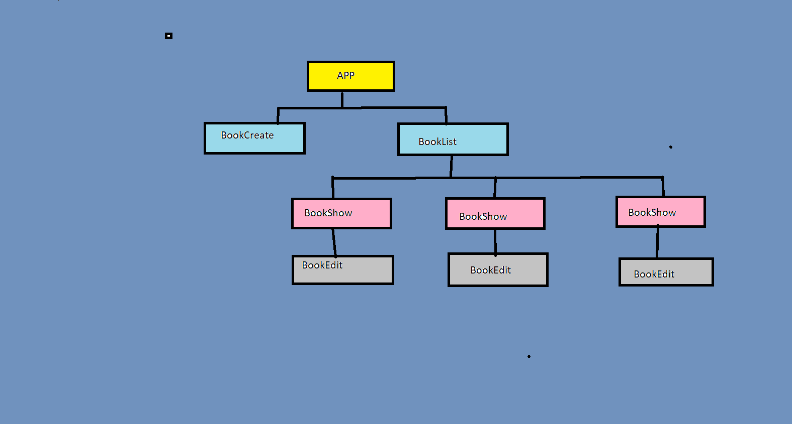

[cheatSheet for state changes](https://state-updates.vercel.app/)

## steps

#### BookCreate Component
##### i) BookCreate is Child component of Parent Component App
##### ii)as soon as user entered title and pressed enter. this child component need to tell his parent that book is added
##### iii) for telling parent book details BookCreate component receives onCreate prop from parent component which passes title name on submitting form in child component to parent component

#### onEdit Props
##### book - An object with id and title
##### onEdit - A function that is called when a user submits the form
##### onSubmit A Function that is called when a user submits the form