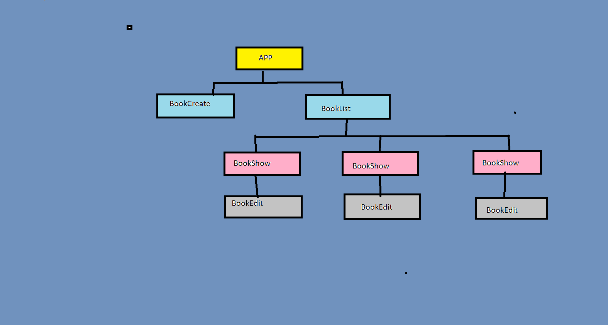

[cheatSheet for state changes](https://state-updates.vercel.app/)

## handleling Forms
#### 1) BookCreate Component
##### i) BookCreate is Child component of Parent Component App
##### ii)as soon as user entered title and pressed enter. this child component need to tell his parent that book is added
##### iii) for telling parent book details BookCreate component receives onCreate prop from parent component which passes title name on submitting form in child component to parent component

#### 2) App Component
##### i)onCreate prop which we are passing to child component BookCreate which excutes createBook function
##### ii)books,onDelete,ondEdit props which we are passing to child component BookList.
##### iii) books-complete object
##### iv)onDelete which executes deleteBookById function
##### v)onEdit which executes editBookById function
#### 3) BookList Component
##### i)receives props from parent componentb books, onDelete, onEdit
##### ii)this component rendered BookShow component by mapping on all books

#### 4)  BookShow Component
##### i)receives props from parent componentb books, onDelete, onEdit
##### ii) showing title and if we click on edit button by setting showEdit true showing BookEdit component to edit title
##### iii) after clicking on Delete button handleDeleteFunction passed book.id in onDelete props
##### iv)when we submit the onEdit Component form we are passing the id as well as newTitle using function handleSubmit in BookShow Component

#### 5) BookEdit Component
##### updating the title in this component
##### book - An object with id and title
##### onSubmit A Function that is called when a user submits the form
##### onSubmit -we are passing id as well as updatedTitle to its parent BookShow